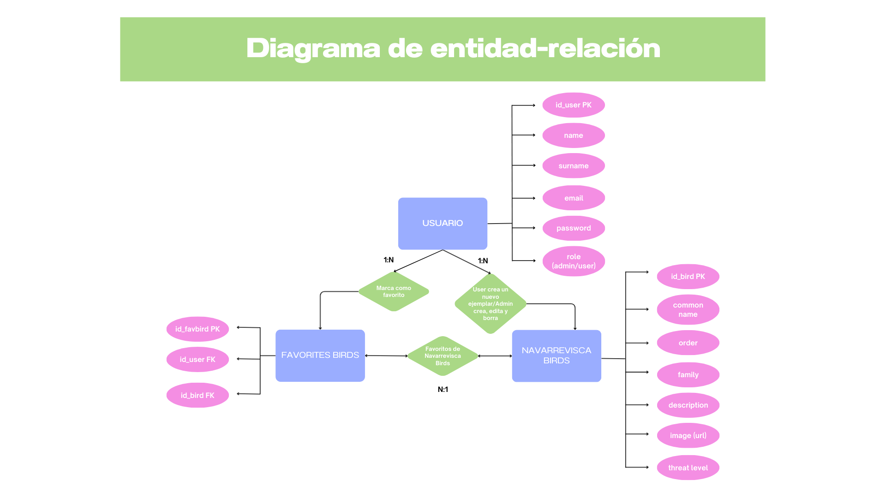

# 🐦 Prueba técnica Fullstack Web Development - Aves de Navarrevisca

Aplicación fullstack, mobile first y completamente responsive, diseñada para explorar, registrar y gestionar información sobre las aves de Navarrevisca y los avistamientos en la Sierra de Gredos. Incluye autenticación completa, panel de administrador, filtros avanzados y documentación de rutas.

🎥 **Vídeo de presentación:**  


---

## ✨ Características principales

- **🔐 Autenticación completa:** Registro e inicio de sesión con JWT y acceso vía Google
- **📱 Diseño mobile first y responsive:** para una experiencia óptima en móviles, tablets y desktop
- **📊 Información en tiempo real:** de avistamientos gracias a la API eBird
- **🕹️ Interfaz limpia e intuitiva:** orientada a ofrecer una experiencia de usuario positiva
- **🧭 Navegación dinámica:** con vistas condicionadas por autenticación y roles (usuario/admin)

---

### 🆙Inicializar el repositorio

```bash
# Clonar el repositorio
git clone https://github.com/crisglezcal/prueba-tecnica-fullstack-web-development.git

# Navegar al directorio del proyecto
cd prueba-tecnica-fullstack-web-development

# Instalar dependencias del frontend
cd frontend
npm install

# Instalar dependencias del backend
cd ../backend
npm install

# Volver a la raíz e instalar dependencias globales (si las hay)
cd ..

# Ejecutar la aplicación
npm run dev

---

## 🛠️ Tecnologías utilizadas

### 🩻 **Backend**
- **Node.js + Express**
- **Express Validator** para validaciones robustas
- **JWT y Google Auth** para autenticación
- **Patrón Modelo-Vista-Controlador (MVC)**
- **Swagger** para documentación de rutas
- **Testing unitario**
- **Dockerfile** para dockerización

### 💁🏽 **Frontend**
- **React + JavaScript**
- **Diseño mobile first**
- **SweetAlert** para notificaciones
- **Spinner loading** para feedback de carga
- **Validaciones con Regex**

### 🗂️ **Base de Datos**
- **SQL** desplegada en **Render**


---

## 🎯 Funcionalidades de la aplicación

### 🔑 Autenticación
- Inicio de sesión y registro con email/contraseña
- Autenticación mediante **Google**
- Reconocimiento del rol: "user" o "admin"

### 🏠 Home
- Información sobre la aplicación
- Contenido informativo sobre la **Sierra de Gredos** y **Navarrevisca**

### 🏔️ Sierra de Gredos
- Avistamientos **en tiempo real** integrados desde la API **eBird**

### 🐤 Aves de Navarrevisca
- Base de datos comunitaria de aves locales
- Vista de detalle para cada especie
- Opción de **marcar como favorito** (si el usuario está logueado)
- **Creación de nuevas aves** para usuarios autenticados
- **Búsqueda en tiempo real** por nombre común, nombre científico y familia
- **Filtro desplegable** por estado de conservación

### ⭐ Favoritos
- Muestra los favoritos del usuario logueado
- Filtros de búsqueda
- Botón **"Eliminar favorito"**

### 🔧 Administrador
- Panel exclusivo para usuarios con rol **admin**
- Funciones:
  - Crear nuevas aves
  - Editar aves existentes
  - Eliminar aves de la base de datos

---

## 🚀 Funcionalidades y mejoras futuras

- Estilos con **SASS**
- Documentación completa con **JSDoc**
- Despliegue fullstack en **Render**
- Subida de **imágenes reales** (no solo URLs)
- Testing unitario ampliado a todo el proyecto
- Mejora y limpieza del Modelo-Vista-Controllador

